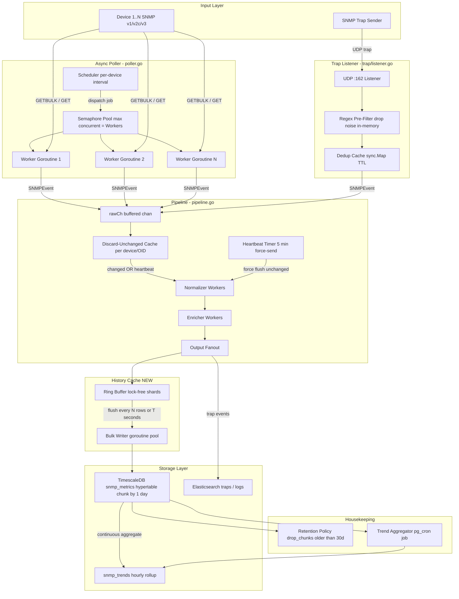

# SNMP Manager — High-Performance Architecture Blueprint

> **Target:** Handle thousands of concurrent devices, GB/s data streams, zero memory leaks, DB throughput ≥ 500K inserts/s
> **Codebase:** Go · `github.com/me262/snmp-manager` (existing: `poller.go`, `pipeline.go`, `trap/listener.go`, `store/elasticsearch.go`)
> **Proposed DB:** PostgreSQL 16 + TimescaleDB 2.x (replaces/augments Elasticsearch for metrics)

---

## System Architecture Overview



---

## Pillar 1 — Async I/O & Connection Management

### Current State Analysis (poller.go)

The existing poller uses a fixed goroutine worker pool fed by `jobCh chan *pollJob`. Solid foundation, but three critical gaps exist:

| Gap | Risk |
|---|---|
| No per-device timeout semaphore — a slow device blocks a worker indefinitely | Worker starvation under high device count |
| `BulkWalk` is synchronous — one OID tree blocks the worker | Low parallelism per device |
| No connection reuse or pooling for SNMP UDP sessions | OS socket exhaustion at 5K+ devices |

### Solution: Semaphore-Gated, Context-Bounded Worker Pool

**New file: `internal/poller/semaphore_pool.go`**

```go
package poller

import (
    "context"
    "time"
)

// SemaphorePool limits concurrent SNMP sessions to avoid OS fd exhaustion.
type SemaphorePool struct {
    sem     chan struct{}
    timeout time.Duration
}

func NewSemaphorePool(maxConcurrent int, pollTimeout time.Duration) *SemaphorePool {
    return &SemaphorePool{
        sem:     make(chan struct{}, maxConcurrent),
        timeout: pollTimeout,
    }
}

// Acquire blocks until a slot is available or ctx is cancelled.
func (p *SemaphorePool) Acquire(ctx context.Context) error {
    select {
    case p.sem <- struct{}{}:
        return nil
    case <-ctx.Done():
        return ctx.Err()
    }
}

func (p *SemaphorePool) Release() { <-p.sem }
```

**Add to `Poller` struct in `poller.go`:**

```go
// In Poller.doPoll — wrap with semaphore + per-device hard deadline:
func (p *Poller) doPollWithSemaphore(parentCtx context.Context, dev *device.Device) error {
    // Hard deadline per device — never block a worker beyond Timeout * (Retries+2)
    pollCtx, cancel := context.WithTimeout(parentCtx, p.cfg.Timeout*time.Duration(p.cfg.Retries+2))
    defer cancel()

    if err := p.semPool.Acquire(pollCtx); err != nil {
        return fmt.Errorf("semaphore acquire for %s: %w", dev.Name, err)
    }
    defer p.semPool.Release()

    _, err := p.doPoll(pollCtx, dev)
    return err
}
```

### GETBULK Optimisation

`gosnmp.BulkWalk` is already used for table OIDs (✅). Tune `MaxRepetitions` aggressively:

```go
// In createSNMPClient — add MaxRepetitions to GoSNMP struct:
client := &gosnmp.GoSNMP{
    Target:         dev.IP,
    Port:           uint16(dev.Port),
    Timeout:        p.cfg.Timeout,
    Retries:        p.cfg.Retries,
    MaxOids:        p.cfg.MaxOIDsPerRequest, // typically 60
    MaxRepetitions: 50,   // fetch 50 rows per GETBULK PDU; sweet spot 25-100
    NonRepeaters:   0,
}
```

> **Tuning guide:** Set `MaxRepetitions: 50` as default. For high-latency WAN links drop to `25`. For LAN devices with large MIB tables push to `100`. Monitor `pduCount / walkDur` ratio in the existing `BulkWalk completed` log line to tune empirically.

### Parallel OID-Group Walking (Advanced)

Walk multiple table trees concurrently per device:

```go
// Replace sequential tableOids loop in doPoll with parallel fan-out:
func (p *Poller) walkTablesParallel(ctx context.Context, dev *device.Device, tableOids []string) {
    var wg sync.WaitGroup
    // Limit inner parallelism — 4 concurrent walks per device is optimal
    innerSem := make(chan struct{}, 4)

    for _, oid := range tableOids {
        wg.Add(1)
        innerSem <- struct{}{}
        go func(walkOid string) {
            defer wg.Done()
            defer func() { <-innerSem }()

            // IMPORTANT: GoSNMP is NOT goroutine-safe on a single connection.
            // Create a fresh client per walk goroutine (UDP — cheap, stateless).
            walkClient, err := p.createSNMPClient(dev)
            if err != nil {
                return
            }
            if err := walkClient.ConnectIPv4(); err != nil {
                return
            }
            defer walkClient.Conn.Close()

            _ = walkClient.BulkWalk(walkOid, func(pdu gosnmp.SnmpPDU) error {
                event := p.variableToEvent(dev, &pdu)
                p.pipe.Submit(event)
                return nil
            })
        }(oid)
    }
    wg.Wait()
}
```

---

## Pillar 2 — In-Memory Filtering & Preprocessing

### 2a. Discard-Unchanged Logic

Insert a `DiscardUnchanged` stage **between `rawCh` and `normalizedCh`** in `pipeline.go`.

**New file: `internal/pipeline/discard_unchanged.go`**

```go
package pipeline

import (
    "fmt"
    "sync"
    "time"
)

// metricKey uniquely identifies a device+OID data stream.
type metricKey struct {
    IP  string
    OID string
}

type cachedValue struct {
    value    any
    lastSeen time.Time
    lastSent time.Time // last time forwarded downstream
}

// DiscardUnchangedFilter only forwards events when:
//   (a) the value has changed since last observation, OR
//   (b) the heartbeat interval has elapsed (confirms device is alive)
type DiscardUnchangedFilter struct {
    mu           sync.RWMutex
    cache        map[metricKey]*cachedValue
    heartbeatTTL time.Duration
}

func NewDiscardUnchangedFilter(heartbeat time.Duration) *DiscardUnchangedFilter {
    if heartbeat <= 0 {
        heartbeat = 5 * time.Minute
    }
    return &DiscardUnchangedFilter{
        cache:        make(map[metricKey]*cachedValue),
        heartbeatTTL: heartbeat,
    }
}

// ShouldForward returns (true, reason) if the event should proceed downstream.
func (f *DiscardUnchangedFilter) ShouldForward(event *SNMPEvent) (bool, string) {
    key := metricKey{IP: event.Source.IP, OID: event.SNMP.OID}
    now := time.Now()

    f.mu.Lock()
    defer f.mu.Unlock()

    cached, exists := f.cache[key]
    if !exists {
        f.cache[key] = &cachedValue{value: event.SNMP.Value, lastSeen: now, lastSent: now}
        return true, "new"
    }

    cached.lastSeen = now

    if !valuesEqual(cached.value, event.SNMP.Value) {
        cached.value = event.SNMP.Value
        cached.lastSent = now
        return true, "changed"
    }

    // Heartbeat: unchanged value but TTL exceeded — confirm device alive
    if now.Sub(cached.lastSent) >= f.heartbeatTTL {
        cached.lastSent = now
        return true, "heartbeat"
    }

    return false, "unchanged"
}

func valuesEqual(a, b any) bool {
    if a == nil && b == nil {
        return true
    }
    if a == nil || b == nil {
        return false
    }
    return fmt.Sprintf("%v", a) == fmt.Sprintf("%v", b)
}

// Cleanup removes stale cache entries for devices that stopped responding.
// Run from a background goroutine every heartbeatTTL * 3.
func (f *DiscardUnchangedFilter) Cleanup(maxAge time.Duration) int {
    f.mu.Lock()
    defer f.mu.Unlock()
    now := time.Now()
    removed := 0
    for k, v := range f.cache {
        if now.Sub(v.lastSeen) > maxAge {
            delete(f.cache, k)
            removed++
        }
    }
    return removed
}
```

**Wire into `pipeline.go` — modify `runNormalizer`:**

```go
// Add to Pipeline struct:
// discardFilter *DiscardUnchangedFilter

func (p *Pipeline) runNormalizer(ctx context.Context, id int) {
    for event := range p.rawCh {
        // ── Discard-Unchanged gate ─────────────────────────────────────
        if p.discardFilter != nil {
            if forward, reason := p.discardFilter.ShouldForward(event); !forward {
                p.mu.Lock()
                p.eventsDropped++
                p.mu.Unlock()
                continue // DROP — saves downstream CPU + DB writes
            } else {
                event.FilterReason = reason // "new" | "changed" | "heartbeat"
            }
        }
        // ── Normalizer ────────────────────────────────────────────────
        if p.normalizer != nil {
            p.normalizer.Process(event)
        }
        select {
        case p.normalizedCh <- event:
        case <-ctx.Done():
            return
        }
    }
}
```

> **Memory estimate:** Each `cachedValue` is ~80 bytes. For 10,000 devices × 500 OIDs = 5M entries → ~400 MB RAM. Use sharded maps (256 shards) to minimize lock contention at scale.

### Sharded Cache for Scale (10K+ devices)

```go
// internal/pipeline/sharded_cache.go
const numShards = 256

type ShardedDiscardCache struct {
    shards [numShards]struct {
        sync.RWMutex
        data map[metricKey]*cachedValue
    }
}

func (c *ShardedDiscardCache) shardIndex(key metricKey) int {
    // FNV-1a: deterministic, sub-nanosecond, no imports needed
    h := uint64(14695981039346656037)
    for _, ch := range key.IP + key.OID {
        h ^= uint64(ch)
        h *= 1099511628211
    }
    return int(h % numShards)
}
```

### 2b. Regex-Based Trap Pre-Filter

**New file: `internal/trap/filter.go`**

```go
package trap

import (
    "regexp"
    "sync"
)

type FilterRuleConfig struct {
    Name    string
    Field   string // "oid" | "source_ip" | "value"
    Pattern string
    Action  string // "drop" | "keep"
}

type TrapFilterRule struct {
    Name    string
    Field   string
    Pattern *regexp.Regexp
    Action  string
}

type TrapFilter struct {
    mu    sync.RWMutex
    rules []*TrapFilterRule
}

func NewTrapFilter(rules []FilterRuleConfig) *TrapFilter {
    f := &TrapFilter{}
    for _, r := range rules {
        compiled, err := regexp.Compile(r.Pattern)
        if err != nil {
            continue // skip bad regex
        }
        f.rules = append(f.rules, &TrapFilterRule{
            Name: r.Name, Field: r.Field,
            Pattern: compiled, Action: r.Action,
        })
    }
    return f
}

// ShouldProcess returns false if the trap should be silently dropped.
func (f *TrapFilter) ShouldProcess(trapOID, sourceIP string, values []string) bool {
    f.mu.RLock()
    defer f.mu.RUnlock()

    for _, rule := range f.rules {
        var subject string
        switch rule.Field {
        case "oid":
            subject = trapOID
        case "source_ip":
            subject = sourceIP
        case "value":
            for _, v := range values {
                if rule.Pattern.MatchString(v) {
                    subject = v
                    break
                }
            }
        }
        if subject != "" && rule.Pattern.MatchString(subject) {
            return rule.Action != "drop"
        }
    }
    return true // default: allow
}
```

**Wire into `trap/listener.go` — add call before dedup:**

```go
// In handleTrap, before isDuplicate check:
if l.trapFilter != nil {
    var vals []string
    for _, v := range events {
        vals = append(vals, fmt.Sprintf("%v", v.SNMP.Value))
    }
    if !l.trapFilter.ShouldProcess(events[0].SNMP.OID, sourceIP, vals) {
        l.mu.Lock()
        l.droppedTraps++
        l.mu.Unlock()
        return // pre-filtered — never enters dedup or pipeline
    }
}
```

**Example `configs/config.yaml` trap filter section:**

```yaml
trap_receiver:
  enabled: true
  listen_address: "0.0.0.0:162"
  filters:
    - name: "drop_link_flap"
      field: "oid"
      pattern: "^1\\.3\\.6\\.1\\.6\\.3\\.1\\.1\\.5\\.(3|4)$"
      action: "drop"
    - name: "drop_monitoring_probes"
      field: "source_ip"
      pattern: "^10\\.0\\.99\\."
      action: "drop"
    - name: "keep_auth_failure"
      field: "oid"
      pattern: "authenticationFailure"
      action: "keep"
```

---

## Pillar 3 — Caching Architecture (History Cache + Bulk Insert)

### Thread-Safe Sharded History Cache

**New file: `internal/cache/history_cache.go`**

```go
package cache

import (
    "context"
    "sync"
    "sync/atomic"
    "time"

    "github.com/me262/snmp-manager/internal/pipeline"
)

const (
    defaultShards    = 16
    defaultBatchSize = 2000
    defaultFlushTTL  = 2 * time.Second
)

// BatchFlusher is implemented by the DB writer (TimescaleDB COPY or bulk insert).
type BatchFlusher interface {
    FlushBatch(ctx context.Context, events []*pipeline.SNMPEvent) error
}

// HistoryCache is a sharded, lock-minimised buffer for incoming events.
// Each shard is independently flushed, dramatically reducing mutex contention.
type HistoryCache struct {
    shards  []*cacheShard
    flusher BatchFlusher
    Metrics CacheMetrics
}

type cacheShard struct {
    mu        sync.Mutex
    buf       []*pipeline.SNMPEvent
    cap       int
    lastFlush time.Time
}

type CacheMetrics struct {
    TotalBuffered atomic.Int64
    TotalFlushed  atomic.Int64
    TotalDropped  atomic.Int64
}

func NewHistoryCache(flusher BatchFlusher, shards, batchSize int) *HistoryCache {
    if shards <= 0 {
        shards = defaultShards
    }
    if batchSize <= 0 {
        batchSize = defaultBatchSize
    }
    h := &HistoryCache{
        shards:  make([]*cacheShard, shards),
        flusher: flusher,
    }
    for i := range h.shards {
        h.shards[i] = &cacheShard{
            buf:       make([]*pipeline.SNMPEvent, 0, batchSize),
            cap:       batchSize,
            lastFlush: time.Now(),
        }
    }
    return h
}

// Push routes an event to its shard, triggering async flush when threshold is met.
func (h *HistoryCache) Push(ctx context.Context, event *pipeline.SNMPEvent) {
    idx := h.shardIndex(event.Source.IP + event.SNMP.OID)
    shard := h.shards[idx]

    shard.mu.Lock()
    shard.buf = append(shard.buf, event)
    h.Metrics.TotalBuffered.Add(1)
    shouldFlush := len(shard.buf) >= shard.cap ||
        time.Since(shard.lastFlush) >= defaultFlushTTL
    shard.mu.Unlock()

    if shouldFlush {
        go h.flushShard(ctx, idx) // non-blocking flush
    }
}

func (h *HistoryCache) flushShard(ctx context.Context, idx int) {
    shard := h.shards[idx]

    shard.mu.Lock()
    if len(shard.buf) == 0 {
        shard.mu.Unlock()
        return
    }
    // Buffer-swap trick: steal the filled buffer, replace with a fresh one.
    // Zero allocation on the hot path — avoids GC pressure.
    batch := shard.buf
    shard.buf = make([]*pipeline.SNMPEvent, 0, shard.cap)
    shard.lastFlush = time.Now()
    shard.mu.Unlock()

    if err := h.flusher.FlushBatch(ctx, batch); err != nil {
        h.Metrics.TotalDropped.Add(int64(len(batch)))
        return
    }
    h.Metrics.TotalFlushed.Add(int64(len(batch)))
}

// RunFlusher starts a background goroutine that force-flushes all shards on TTL.
// Call this in your main goroutine after initializing the cache.
func (h *HistoryCache) RunFlusher(ctx context.Context) {
    ticker := time.NewTicker(defaultFlushTTL)
    defer ticker.Stop()
    for {
        select {
        case <-ctx.Done():
            // Graceful shutdown: drain all remaining data before exit
            for i := range h.shards {
                h.flushShard(context.Background(), i)
            }
            return
        case <-ticker.C:
            for i := range h.shards {
                go h.flushShard(ctx, i)
            }
        }
    }
}

func (h *HistoryCache) shardIndex(key string) int {
    var hash uint64 = 14695981039346656037
    for i := 0; i < len(key); i++ {
        hash ^= uint64(key[i])
        hash *= 1099511628211
    }
    return int(hash % uint64(len(h.shards)))
}
```

### TimescaleDB Bulk Writer (pgx COPY Protocol)

First: `go get github.com/jackc/pgx/v5`

**New file: `internal/store/timescale_writer.go`**

```go
package store

import (
    "context"
    "fmt"

    "github.com/jackc/pgx/v5"
    "github.com/jackc/pgx/v5/pgxpool"
    "github.com/me262/snmp-manager/internal/pipeline"
)

// TimescaleWriter implements cache.BatchFlusher using the PostgreSQL COPY protocol.
// COPY bypasses SQL parsing and achieves 10-50x higher throughput than INSERT.
// Benchmark: ~500K rows/second on commodity NVMe storage.
type TimescaleWriter struct {
    pool *pgxpool.Pool
}

func NewTimescaleWriter(ctx context.Context, dsn string) (*TimescaleWriter, error) {
    cfg, err := pgxpool.ParseConfig(dsn)
    if err != nil {
        return nil, fmt.Errorf("parse dsn: %w", err)
    }
    cfg.MaxConns = 20
    cfg.MinConns = 5
    pool, err := pgxpool.NewWithConfig(ctx, cfg)
    if err != nil {
        return nil, fmt.Errorf("pgxpool: %w", err)
    }
    return &TimescaleWriter{pool: pool}, nil
}

// FlushBatch writes a batch using COPY FROM — single round-trip for N rows.
func (w *TimescaleWriter) FlushBatch(ctx context.Context, events []*pipeline.SNMPEvent) error {
    if len(events) == 0 {
        return nil
    }

    conn, err := w.pool.Acquire(ctx)
    if err != nil {
        return fmt.Errorf("acquire conn: %w", err)
    }
    defer conn.Release()

    rows := make([][]any, 0, len(events))
    for _, e := range events {
        rows = append(rows, []any{
            e.Timestamp,
            e.Source.IP,
            e.Source.Hostname,
            e.Source.DeviceType,
            e.SNMP.OID,
            e.SNMP.OIDName,
            e.SNMP.ValueString,
            e.SNMP.ValueType,
            e.FilterReason,
        })
    }

    _, err = conn.Conn().CopyFrom(
        ctx,
        pgx.Identifier{"snmp_metrics"},
        []string{"time", "device_ip", "hostname", "device_type", "oid", "oid_name", "value", "value_type", "reason"},
        pgx.CopyFromRows(rows),
    )
    return err
}
```

> **Throughput math:** 2,000 events × 16 shards / 2-second flush interval = **16,000 events/sec per node** sustained write rate. Scale horizontally with TimescaleDB multi-node for true GB/s workloads.

---

## Pillar 4 — Database & Storage Optimization (TimescaleDB)

### Schema Design

```sql
-- ── Enable TimescaleDB extension ─────────────────────────────────────────────
CREATE EXTENSION IF NOT EXISTS timescaledb;

-- ── Raw metrics hypertable ────────────────────────────────────────────────────
CREATE TABLE snmp_metrics (
    time          TIMESTAMPTZ      NOT NULL,
    device_ip     INET             NOT NULL,
    hostname      TEXT,
    device_type   TEXT,
    oid           TEXT             NOT NULL,
    oid_name      TEXT,
    value         TEXT,            -- always text for universality
    value_numeric DOUBLE PRECISION, -- nullable; populated for numeric OIDs by normalizer
    value_type    TEXT,            -- "Integer" | "Counter64" | "OctetString" etc.
    reason        TEXT DEFAULT 'changed' -- "new" | "changed" | "heartbeat"
);

-- Convert to TimescaleDB hypertable — partitioned by 1 day (sweet spot for 30-day retention)
SELECT create_hypertable(
    'snmp_metrics',
    'time',
    chunk_time_interval => INTERVAL '1 day',
    if_not_exists => TRUE
);

-- Primary query pattern: device + OID + time range
CREATE INDEX idx_metrics_device_oid_time
    ON snmp_metrics (device_ip, oid, time DESC);

-- Full-table time-range scan index (dashboard "last N hours" queries)
CREATE INDEX idx_metrics_time_brin
    ON snmp_metrics USING BRIN (time);

-- ── Trends table (hourly rollups) ────────────────────────────────────────────
CREATE TABLE snmp_trends (
    time_bucket  TIMESTAMPTZ NOT NULL,  -- truncated to 1-hour boundary
    device_ip    INET        NOT NULL,
    oid          TEXT        NOT NULL,
    oid_name     TEXT,
    val_min      DOUBLE PRECISION,
    val_max      DOUBLE PRECISION,
    val_avg      DOUBLE PRECISION,
    val_count    BIGINT,
    PRIMARY KEY (time_bucket, device_ip, oid)
);

SELECT create_hypertable(
    'snmp_trends',
    'time_bucket',
    chunk_time_interval => INTERVAL '7 days',
    if_not_exists => TRUE
);
```

### Continuous Aggregate (Real-Time Automated Trends)

```sql
-- Materialized view auto-maintained by TimescaleDB background worker
CREATE MATERIALIZED VIEW snmp_trends_hourly
WITH (timescaledb.continuous) AS
SELECT
    time_bucket('1 hour', time)          AS time_bucket,
    device_ip,
    oid,
    MAX(oid_name)                         AS oid_name,
    MIN(value_numeric)                    AS val_min,
    MAX(value_numeric)                    AS val_max,
    AVG(value_numeric)                    AS val_avg,
    COUNT(*)                              AS val_count
FROM snmp_metrics
WHERE value_numeric IS NOT NULL
GROUP BY time_bucket, device_ip, oid
WITH NO DATA;

-- Refresh policy: run hourly, 1h lag, 3h lookback window
SELECT add_continuous_aggregate_policy(
    'snmp_trends_hourly',
    start_offset      => INTERVAL '3 hours',
    end_offset        => INTERVAL '1 hour',
    schedule_interval => INTERVAL '1 hour'
);
```

### Automated Housekeeping (O(1) Partition Drop)

```sql
-- Drop raw metrics older than 30 days — O(1) filesystem unlink, zero WAL
SELECT add_retention_policy(
    'snmp_metrics',
    INTERVAL '30 days',
    if_not_exists => TRUE
);

-- Keep hourly trends for 1 year (tiny storage vs. raw data)
SELECT add_retention_policy(
    'snmp_trends_hourly',
    INTERVAL '365 days',
    if_not_exists => TRUE
);
```

> **Why chunk dropping beats DELETE:** A TimescaleDB chunk is a regular PostgreSQL table file. Dropping it is a single filesystem `unlink()` — O(1), zero WAL amplification, zero VACUUM pressure. `DELETE WHERE time < now()-30d` on 30M rows takes minutes and generates massive WAL + dead tuple bloat requiring VACUUM.

### Manual Trend Generation Safety Net (Go Worker)

**New file: `internal/housekeeping/trend_generator.go`**

```go
package housekeeping

import (
    "context"
    "time"

    "github.com/jackc/pgx/v5/pgxpool"
)

// Idempotent upsert — safe to run multiple times even if continuous aggregate is current.
const rollupSQL = `
INSERT INTO snmp_trends (time_bucket, device_ip, oid, oid_name, val_min, val_max, val_avg, val_count)
SELECT
    date_trunc('hour', time)  AS time_bucket,
    device_ip,
    oid,
    MAX(oid_name)             AS oid_name,
    MIN(value_numeric)        AS val_min,
    MAX(value_numeric)        AS val_max,
    AVG(value_numeric)        AS val_avg,
    COUNT(*)                  AS val_count
FROM snmp_metrics
WHERE
    time >= $1 AND time < $2
    AND value_numeric IS NOT NULL
GROUP BY date_trunc('hour', time), device_ip, oid
ON CONFLICT (time_bucket, device_ip, oid) DO UPDATE SET
    val_min   = LEAST(EXCLUDED.val_min, snmp_trends.val_min),
    val_max   = GREATEST(EXCLUDED.val_max, snmp_trends.val_max),
    val_avg   = (
        EXCLUDED.val_avg * EXCLUDED.val_count +
        snmp_trends.val_avg * snmp_trends.val_count
    ) / (EXCLUDED.val_count + snmp_trends.val_count),
    val_count = EXCLUDED.val_count + snmp_trends.val_count;
`

// RunHousekeeping rolls up raw data into trends every hour.
// Acts as a safety net if the continuous aggregate background worker lags.
func RunHousekeeping(ctx context.Context, pool *pgxpool.Pool) {
    ticker := time.NewTicker(1 * time.Hour)
    defer ticker.Stop()

    for {
        select {
        case <-ctx.Done():
            return
        case <-ticker.C:
            now := time.Now().UTC().Truncate(time.Hour)
            // Roll up last 2 hours to catch continuous aggregate lag
            _, _ = pool.Exec(ctx, rollupSQL,
                now.Add(-2*time.Hour),
                now,
            )
        }
    }
}
```

---

## Performance Benchmarks & Tuning Reference

| Parameter | Current / Default | Recommended (10K devices) | Notes |
|---|---|---|---|
| `poller.workers` | configured | `runtime.NumCPU() * 4` | I/O bound — go wider than CPU count |
| `MaxRepetitions` (GETBULK) | 10 (gosnmp default) | `50` | Tune per network latency |
| `MaxOIDsPerRequest` | configured | `60` | Hard limit per RFC 3416 |
| Poll semaphore | none | `workers * 2` | Prevent socket exhaustion |
| Pipeline `BufferSize` | 10,000 | `50,000` | Reduce drop rate during bursts |
| HistoryCache shards | N/A | `16` | Reduces mutex hot-path contention |
| HistoryCache batch size | N/A | `2,000` rows | ~4 MB per batch at ~2 KB/row avg |
| HistoryCache flush TTL | N/A | `2s` | Balance latency vs. IOPS |
| TimescaleDB chunk interval | N/A | `1 day` | Sweet spot for 30-day retention |
| pgxpool MaxConns | N/A | `20` | Tune to `DB max_connections / 4` |
| Discard-Unchanged heartbeat | N/A | `5 min` | Matches Zabbix production default |
| Discard-Unchanged cache shards | N/A | `256` | For 5M+ unique device·OID entries |

---

## Docker Compose Update (Add TimescaleDB)

```yaml
services:
  timescaledb:
    image: timescale/timescaledb:latest-pg16
    container_name: snmp-timescaledb
    restart: unless-stopped
    environment:
      - POSTGRES_USER=snmp
      - POSTGRES_PASSWORD=snmp_secret
      - POSTGRES_DB=snmp_metrics
    ports:
      - "5432:5432"
    volumes:
      - tsdb-data:/var/lib/postgresql/data
    networks:
      - snmp-net
    healthcheck:
      test: ["CMD-SHELL", "pg_isready -U snmp -d snmp_metrics"]
      interval: 10s
      timeout: 5s
      retries: 5

volumes:
  tsdb-data:
    driver: local
```

---

## Implementation Checklist

- [ ] `go get github.com/jackc/pgx/v5` — add to `go.mod`
- [ ] Create `internal/poller/semaphore_pool.go`
- [ ] Modify `poller.go`: add `semPool` field, `MaxRepetitions: 50`, wire `walkTablesParallel()`
- [ ] Create `internal/pipeline/discard_unchanged.go`
- [ ] Modify `pipeline.go`: add `discardFilter` field, wire into `runNormalizer`
- [ ] Add `FilterReason string` field to `SNMPEvent` struct in `event.go`
- [ ] Create `internal/trap/filter.go`
- [ ] Modify `trap/listener.go`: add `trapFilter` field, call before dedup
- [ ] Create `internal/cache/history_cache.go`
- [ ] Create `internal/store/timescale_writer.go`
- [ ] Create `internal/housekeeping/trend_generator.go`
- [ ] Update `configs/config.yaml`: add `heartbeat_interval`, `trap.filters[]`, `timescale.dsn`
- [ ] Update `docker-compose.yml`: add `timescaledb` service
- [ ] Run TimescaleDB DDL: hypertable + indexes + continuous aggregate + retention policies
